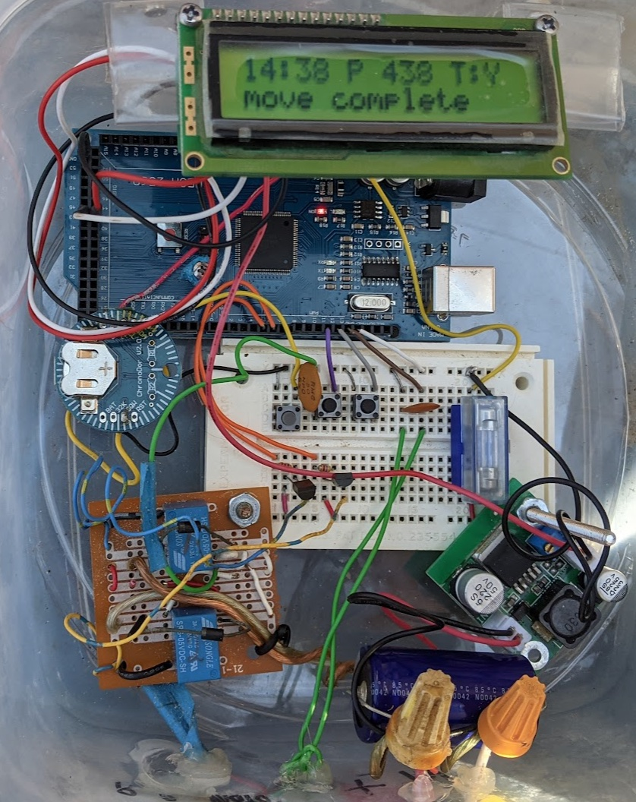

# Solar_Tracker_Positional

This is an Arduino program which uses a linear actuator with a reed switch to make a single axis solar tracker move with no visual reference to the sun.  It uses the [Solar Position library](https://github.com/KenWillmott/SolarPosition) by Ken Willmott to determine the sun's current azimuth, given the GPS coordinate location of the tracker and the current time.

Read the User notes from the following section to understand how the controller is supposed to function.

## End user guide

If anyone else wants to use this and finds the documentation lacking, let me know with an issue what parts don't make sense and I'll try to make the documentation more complete.  For now, the documentation is meant as a reference for me to re-configure the device if power is lost or the clock's battery dies or some part of the circuit stops working.  The user level notes are at [User notes](https://jpangburn.github.io/solartracker/)

## Schematic and physical implementation notes

The actual implementation has some minor variations from the schematic:

- The 9 volt regulator from the schematic is implemented with a 9v regulator board I had laying around.
- The motor header in the schematic is implemented with an old motor controller I had made years ago.  It's not a good motor controller and the use of transistors coming from 5V instead of draining to ground is not an example to be followed, but as that's what the motor controller needed that's how I implemented it.  You should adapt whatever motor controller you want to use to that jumper setup.
- The pin order for the BPI-216 serial LCD display might be wrong, I just made up that part as I couldn't find a library with it.  If you use a different serial display, you may have to make changes in the code to configure it properly.

Things to watch out for if you make your own:

-  After you've built it you should zero the controller, run the motor out for at least 10 seconds, and run it back to position 0.  If it's at the same exact physical position then you're good to go, but if not it means that it's missing counts.  Do this several times to make sure the count is accurate.  There are two reasons that come instantly to mind for why the count can be bad:
   - With 12v supplied, my linear actuator gave a high (5V) pulse width of 120 ms and the low pulse width was over 300 ms.  If your pulse width (either one) is significantly shorter than 120 ms, then it's possible the averaging function is missing your pulses.  That function is designed to filter spurious motor noise spikes at the sensor but for a short sensor pulse it may need to be more sensitive.  Look for this line `const float ALPHA = 0.1;` and increase that value slowly until your count is reliably accurate.  NOTE: I replaced that actuator with another whose shorter pulse width was 70ms and that works fine too.
   - If your motor is really noisy and not filtered well by your motor controller, try changing the capacitor size across the 12V input.  Attaching an oscilloscope will REALLY help with this process, ask me how I know.  Motor noise can mess up the microcontroller's ability to discern the sensor value.  If your sensor pulse width is longer than mine, you can also reliably lower the ALPHA value mentioned above to make the averaging function even more resistant to noise.
- Make sure you supply a strong enough battery to move your motor for a few cloudy days in a row!  I used a 12V car battery.  Also make sure your solar array is charging this battery (duh).  In my implementation it uses about 15 milliamps when idle (the vast majority of its life is spent idle), so in a day this is 0.3 amp hours.  My motor spends 8 minutes moving per day at about an amp so I think that's 0.13 amp hours per day for movement.  So we're talking 430 milliamp hours per day.  If you use a really tiny battery you'll be sorry after a few cloudy days.  A 12v car battery is overkill, but I didn't want to deal with battery issues so...

Here's my sensor signal for reference (when the red line goes low it's turning the motor on).

## How to update

If a code change becomes necessary, follow these steps:

1. Download this repository
2. Edit code in Arduino IDE and compile to make sure the code is ok
3. Move tracker to east limit
4. Plug USB into laptop, select port and board (MEGA 2560 currently), and click upload
5. Disconnect USB
6. Follow setup instructions in the [User notes](https://jpangburn.github.io/solartracker/) under the "Setup After Reset" section
7. Upload modified code to GitHub so it's not lost
