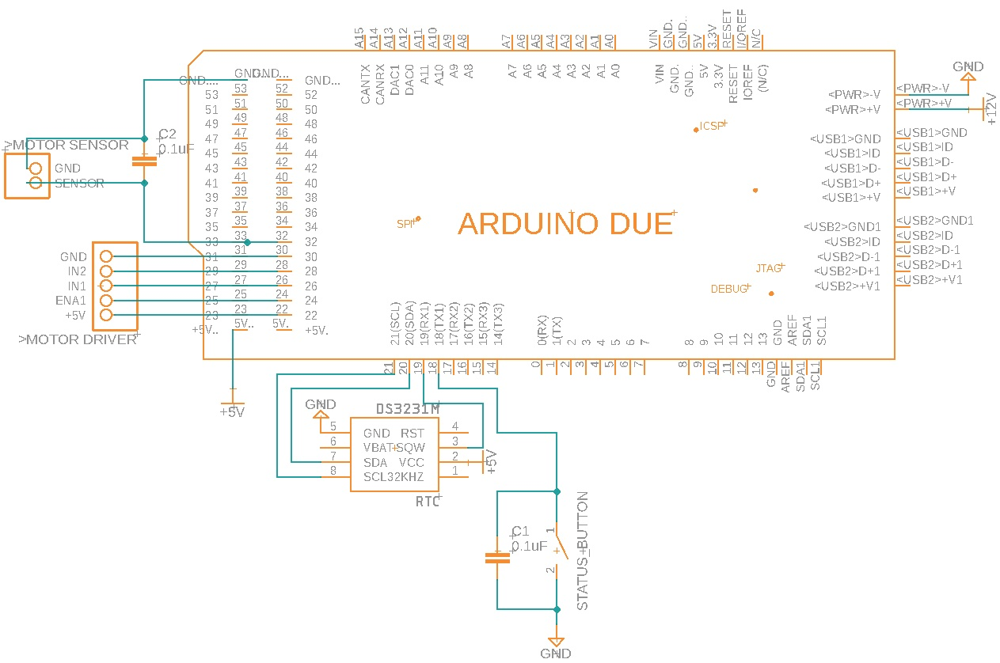

# Solar_Tracker_Positional_TFT

This is an Arduino program which uses a linear actuator with a reed switch to make a single axis solar tracker move with no visual reference to the sun.  It uses the [Solar Position library](https://github.com/KenWillmott/SolarPosition) by Ken Willmott to determine the sun's current azimuth, given the GPS coordinate location of the tracker and the current time.

This differs from the previous [Solar Tracker Positional](https://github.com/jpangburn/Solar_Tracker_Positional) code I posted in two major ways. 1. It uses a TFT display instead of an LCD display. 2. It uses more power because the TFT display is unable to be shut down so it stays on all the time, and the Arduino Due can't be shut down because it doesn't work with the avr/sleep.h library that I used.  This one is running right by my battery shed and uses about 1.4 watts so I just didn't worry about power, but if you are running a tracker on a small battery then saving power is more important and you might want to use the non-TFT version.

Read the User notes from the following section to understand how the controller is supposed to function.

## End user guide

If anyone else wants to use this and finds the documentation lacking, let me know with an issue what parts don't make sense and I'll try to make the documentation more complete.  For now, the documentation is meant as a reference for me to re-configure the device if power is lost or the clock's battery dies or some part of the circuit stops working.  The user level notes are at [User notes](https://jpangburn.github.io/solartrackertft/)

## Schematic and physical implementation notes

More pictures of the implemtation at the bottom in case a different view helps.

The actual implementation has some minor variations from the schematic:

- The schematic doesn't include the TFT LCD Arduino Shield because there's a lot of connections and the description of those connections is kind of pointless because the shield is just directly pressed onto the Arduino.
- The motor driver is implemented with a XY-160D, which you can pick up on Amazon for about $16.  The pin order on my MOTOR_DRIVER part matches the pin order of that driver.  The driver is quite overpowered as it can supply 7 amps continuously and most linear actuators you'd use for a tracker are probably in the 2 amp range, but if you have an enormous tracker with a huge actuator it would almost certainly still work for you.  It has a second motor control option which I like as I might expand this to a two axis control at some point.
- The schematic doesn't include the 12v power to the motor driver, or wiring from motor driver to the motor. 

Things to watch out for if you make your own:

-  After you've built it you should zero the controller, run the motor out for at least 10 seconds, and run it back to position 0.  If it's at the same exact physical position then you're good to go, but if not it means that it's missing counts.  Do this several times to make sure the count is accurate.  There are two reasons that come instantly to mind for why the count can be bad:
   - With 12v supplied, my linear actuator gave a high (5V) pulse width of 120 ms and the low pulse width was over 300 ms.  If your pulse width (either one) is significantly shorter than 120 ms, then it's possible the averaging function is missing your pulses.  That function is designed to filter spurious motor noise spikes at the sensor but for a short sensor pulse it may need to be more sensitive.  Look for this line `const float ALPHA = 0.1;` and increase that value slowly until your count is reliably accurate.  NOTE: I replaced that actuator with another whose shorter pulse width was 70ms and that works fine too.
   - If your motor is really noisy and not filtered well by your motor controller back to the power supply that runs the microcontroller, try changing the capacitor size across the 12V input.  Attaching an oscilloscope will REALLY help with this process, ask me how I know.  Motor noise can mess up the microcontroller's ability to discern the sensor value.  If your sensor pulse width is longer than mine, you can also reliably lower the ALPHA value mentioned above to make the averaging function even more resistant to noise.
- Leaving the controller and TFT running all the time uses about 1.4 watts.  You probably want this hooked to your main battery pack as that adds up over a few cloudy days.

Here's my sensor signal for reference (when the red line goes low it's turning the motor on).

## How to update

If a code change becomes necessary, follow these steps:

1. Download this repository
2. Edit code in Arduino IDE and compile to make sure the code is ok
3. Move tracker to east limit
4. Plug USB into laptop, select port and board (MEGA 2560 currently), and click upload
5. Disconnect USB
6. Follow setup instructions in the [User notes](https://jpangburn.github.io/solartrackertft/) under the "Setup After Reset" section
7. Upload modified code to GitHub so it's not lost

## Other views of implementation

